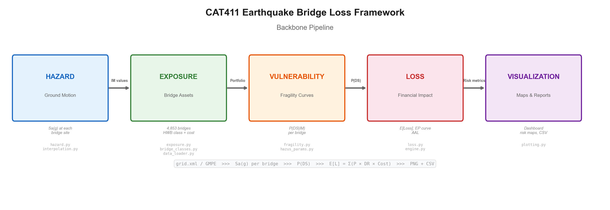
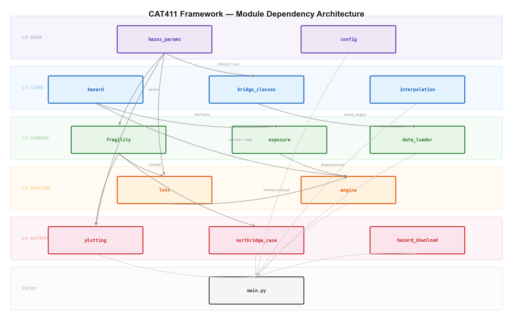

# CAT411 — Seismic Bridge Loss Estimation Framework

[](https://www.python.org/)
[](LICENSE)
[](https://www.fema.gov/hazus)

A modular catastrophe (CAT) modeling pipeline for **earthquake-induced bridge damage and loss estimation**, implementing the FEMA Hazus 6.1 methodology with enhancements for spatial interpolation, calibration, and probabilistic risk assessment.

---

## Table of Contents

1. [Architecture Overview](#1-architecture-overview)
2. [Getting Started](#2-getting-started)
3. [Configuration Reference](#3-configuration-reference)
4. [Data Pipeline](#4-data-pipeline)
5. [Module Reference](#5-module-reference)
6. [Mathematical Formulation](#6-mathematical-formulation)
7. [Validation & Quality Assurance](#7-validation--quality-assurance)
8. [Output Specification](#8-output-specification)
9. [API Examples](#9-api-examples)
10. [Known Limitations](#10-known-limitations)
11. [References](#11-references)

---

## 1. Architecture Overview

The framework follows the standard **four-component CAT model architecture** widely adopted in catastrophe risk engineering:

```
                    ┌─────────────────────────────────────────────────┐
                    │           CAT411 Processing Pipeline            │
                    └─────────────────────────────────────────────────┘

  ┌──────────┐     ┌──────────┐     ┌──────────────┐     ┌──────┐     ┌──────────────┐
  │  HAZARD  │────>│ EXPOSURE │────>│VULNERABILITY │────>│ LOSS │────>│VISUALIZATION │
  │          │     │          │     │              │     │      │     │              │
  │ Sa(g) at │     │ 2,953+   │     │ P(DS|IM)     │     │E[L]  │     │ Maps, CSV,   │
  │ each site│     │ bridges  │     │ per bridge   │     │EP,AAL│     │ dashboards   │
  └──────────┘     └──────────┘     └──────────────┘     └──────┘     └──────────────┘
     hazard.py       exposure.py      fragility.py        loss.py       plotting.py
  interpolation.py  data_loader.py   hazus_params.py     engine.py
                   bridge_classes.py
```

**Data flow (two paths converge at `im_selected`):**

```
[Path A: ShakeMap]                         [Path B: GMPE]
config: im_source=shakemap                 config: im_source=gmpe, gmpe_model=bssa21
  ↓                                          ↓
load grid.xml                              build EarthquakeScenario from gmpe_scenario
  ↓                                          ↓
interpolate_im() at bridge sites           get_gmpe("bssa21").compute(Mw,Rjb,Vs30,...)
  ↓                                          ↓
         nbi["im_selected"]  ←─────────────────┘
                ↓
        fragility_curve() → damage_state_probabilities() → E[Loss] → EP, AAL
```

Path A (ShakeMap) uses data-conditioned ground motions from a historical event. Path B (GMPE) computes ground motions from a forward scenario prediction — ideal for what-if analyses and PSHA.

### Module Dependency Graph (5-Layer Architecture)

```
Layer 0 - DATA        hazus_params.py ──── config.py ──── gmpe_base.py
                          │                    │               │
Layer 1 - CORE        hazard.py   bridge_classes.py   gmpe_bssa21.py  gmpe_ba08.py
                          │              │              interpolation.py
                          │              │                   │
Layer 2 - DOMAIN      fragility.py   exposure.py       data_loader.py
                          │              │                   │
Layer 3 - PIPELINE       loss.py ──────── engine.py ────────┘
                          │                   │
Layer 4 - OUTPUT      plotting.py   northridge_case.py   hazard_download.py
                          │                   │                   │
ENTRY                     └──────── main.py ──┘───────────────────┘
```

Each layer only depends on layers above it (no upward or circular dependencies). This enforces a clean separation of concerns and ensures that modifying a lower-layer module cannot break upper-layer data definitions.




---

## 2. Getting Started

### Prerequisites

- Python 3.10 or later
- NumPy, SciPy, pandas, matplotlib, requests, PyYAML

```bash
pip install -r requirements.txt
```

### Run Modes

| Command | Description |
|---------|-------------|
| `python main.py` | Default: download ShakeMap + full analysis using `config.yaml` |
| `python main.py --pipeline` | Deterministic CAT model (synthetic portfolio, BA08 GMPE) |
| `python main.py --probabilistic` | Probabilistic: stochastic catalog → EP curve + AAL |
| `python main.py --fragility-only` | Generate fragility curve plots only |
| `python main.py --download-hazard` | Download USGS ShakeMap data |
| `python main.py --full-analysis` | End-to-end automated analysis (recommended) |

### CLI Flags

| Flag | Default | Description |
|------|---------|-------------|
| `--config PATH` | `config.yaml` | Path to YAML configuration file |
| `--im-type TYPE` | `SA10` | Override IM type: `PGA`, `SA03`, `SA10`, `SA30` |
| `--nbi-filter EXPR` | — | NBI column filters (e.g., `county=037`, `year_built>1960`) |
| `--n-bridges N` | `100` | Synthetic portfolio size (pipeline mode) |
| `--n-realizations N` | `50` | Monte Carlo realizations per event |
| `--n-events N` | `50` | Stochastic events (probabilistic mode) |

CLI arguments override corresponding `config.yaml` settings.

---

## 3. Configuration Reference

All analysis parameters are centralized in `config.yaml`. The configuration system implements **fail-fast validation** — invalid IM-type/fragility combinations are rejected at load time, not at computation time.

```yaml
# ── Ground Motion Source ───────────────────────
im_source: shakemap          # "shakemap" (from grid.xml) or "gmpe" (forward prediction)
im_type:   SA10              # PGA | SA03 | SA10 | SA30
gmpe_model: bssa21           # "ba08" or "bssa21" (only used when im_source=gmpe)

# ── Spatial Interpolation ─────────────────────
interpolation:
  method: nearest            # nearest | idw | bilinear | natural_neighbor | kriging
  power: 2.0                 # IDW exponent (only for idw)
  n_neighbors: 8             # Neighbor count (idw, kriging)
  range_km: 50.0             # Variogram range (kriging)
  nugget: 0.01               # Measurement noise (kriging)

# ── Study Region ──────────────────────────────
region:
  lat_min: 33.8
  lat_max: 34.6
  lon_min: -118.9
  lon_max: -118.0

# ── Bridge Selection Filters ──────────────────
bridge_selection:
  county: "037"              # Exact string match
  year_built: ">1960"        # Numeric comparison
  material: ["concrete"]     # List match (OR logic)

hwb_filter: [HWB3, HWB5]    # Restrict to specific HWB classes
design_era: conventional     # "conventional" or "seismic"

# ── GMPE Scenario (required when im_source=gmpe) ──
gmpe_scenario:
  magnitude: 6.7
  lat: 34.213
  lon: -118.537
  depth_km: 18.4
  fault_type: reverse        # "strike_slip" | "normal" | "reverse" | "unspecified"
  vs30: 360.0                # Default site Vs30 (used if bridge has no Vs30 column)

# ── Fragility Overrides ──────────────────────
# REQUIRED when im_type != SA10 (Hazus defaults are Sa(1.0s)-calibrated)
fragility_overrides:
  HWB5:
    slight:    { median: 0.30, beta: 0.55 }
    moderate:  { median: 0.50, beta: 0.55 }
    extensive: { median: 0.70, beta: 0.55 }
    complete:  { median: 1.00, beta: 0.55 }

# ── Calibration Factors ──────────────────────
calibration:
  global_median_factor: 1.0  # Applied to all classes (< 1.0 = more vulnerable)
  class_factors:
    HWB5: 0.90               # Class-specific override

# ── Monte Carlo Settings ─────────────────────
analysis:
  n_realizations: 50
  n_events: 50
  seed: 42
```

### Validation Rules

The configuration loader enforces:

1. **IM-Fragility compatibility**: If `im_type` ≠ `SA10` and no `fragility_overrides` are provided, the framework raises `ValueError` at load time. This prevents silently feeding PGA values into Sa(1.0s)-calibrated fragility curves — a physically meaningless computation.

2. **IM availability check**: At runtime, if the configured IM type is not present in the ShakeMap grid data, a `ValueError` is raised with the list of available IM columns. This replaces a previous silent fallback to 0.0g that produced zero-damage results without warning.

3. **Zero-IM warning**: Bridges that receive IM ≤ 0.0g after spatial interpolation trigger a `UserWarning` with count, indicating potential spatial extent mismatch between ShakeMap and bridge inventory.

4. **GMPE scenario requirement**: If `im_source: gmpe`, a `gmpe_scenario` block must be present. The `gmpe_model` value must be a registered model name (`ba08` or `bssa21`). Unknown models raise `ValueError` at load time.

---

## 4. Data Pipeline

### Input Data Sources

| Source | File | Format | Records | Description |
|--------|------|--------|---------|-------------|
| **FHWA NBI** | `data/CA24.txt` | Fixed-width | ~25,000 | National Bridge Inventory — California bridges with structural attributes |
| **USGS ShakeMap** | `data/grid.xml` | XML grid | ~50,000 pts | Ground motion intensities: PGA, PGV, PSA03, PSA10, PSA30, SVEL |
| **Station List** | `data/stationlist.json` | JSON | ~400 | Seismic station recordings (for ShakeMap validation) |

### Processing Pipeline

```
NBI raw (CA24.txt)
  │
  ├── parse_nbi()               → DataFrame with 50+ NBI columns
  ├── apply config filters      → Subset by region, county, material, year, etc.
  ├── classify_nbi_to_hazus()   → Assign HWB class via decision tree
  │     Uses: NBI_MATERIAL_MAP (item 43A), NBI_DESIGN_MAP (item 43B),
  │           span count, length, year_built vs 1990 cutoff
  │
  └── Output: data/nbi_classified.csv (2,953 bridges for Northridge region)

ShakeMap (grid.xml)
  │
  ├── load_shakemap()           → DataFrame with LAT, LON, PGA, PSA03, PSA10, etc.
  ├── Unit conversion           → %g → g (divide by 100)
  ├── interpolate_im()          → Sa(g) at each bridge location
  │     Methods: nearest (KD-tree), IDW, bilinear, natural_neighbor, kriging
  │
  └── Output: im_selected column on bridge DataFrame
```

### HWB Classification Decision Tree

The NBI-to-Hazus bridge classification (`src/bridge_classes.py`) implements the Hazus Table 7.3 decision tree:

```
NBI Bridge Record
  ├── Length > 150m?
  │     ├── Yes → year_built ≥ 1990? → HWB2 (Major, Seismic) : HWB1 (Major, Conv.)
  │     └── No ↓
  ├── Number of spans == 1?
  │     ├── Concrete → year ≥ 1990? → HWB4 (Single Concrete, Seismic) : HWB3
  │     └── Steel    → year ≥ 1990? → HWB16 (Single Steel, Seismic) : HWB15
  └── Multi-span:
        ├── Concrete Continuous → year ≥ 1990? → HWB6 : HWB5
        ├── Concrete Simply-Supported → year ≥ 1990? → HWB8 : HWB7
        ├── Steel Continuous → year ≥ 1990? → HWB11 : HWB10
        └── Other → HWB28 (catch-all)
```

The 1990 cutoff reflects the post-Loma Prieta seismic design code adoption in California.

### Directory Structure

```
data/
├── CA24.txt                    ← NBI raw file
├── grid.xml                    ← ShakeMap grid
├── stationlist.json            ← Station recordings
├── nbi_classified.csv          ← Classified bridge inventory (generated)
├── nbi_hwb_summary.csv         ← Per-class statistics (generated)
├── nbi/
│   ├── raw/                    ← Downloaded NBI archives
│   ├── clean/                  ← Cleaned CSV
│   ├── curated/                ← Filtered + classified
│   └── meta/                   ← Processing metadata
└── hazard/usgs/
    ├── shakemap/               ← ShakeMap files
    └── hazard_curves/          ← NSHMP probabilistic curves
```

---

## 5. Module Reference

### Layer 0: Data (Static Parameters)

| Module | Purpose | Key Exports |
|--------|---------|-------------|
| `src/hazus_params.py` | Hazus 6.1 Table 7.9 fragility parameters for 14 HWB classes | `HAZUS_BRIDGE_FRAGILITY`, `DAMAGE_STATE_ORDER` |
| `src/config.py` | YAML config loader with fail-fast validation | `AnalysisConfig`, `load_config()`, `IM_COLUMN_MAP` |
| `src/gmpe_base.py` | GMPE protocol, model registry, IM-period mapping | `GMPEModel`, `GMPE_REGISTRY`, `get_gmpe()`, `IM_TYPE_TO_PERIOD` |

### Layer 1: Core (Fundamental Computations)

| Module | Purpose | Key Exports |
|--------|---------|-------------|
| `src/hazard.py` | Boore-Atkinson 2008 GMPE, spatial correlation, GMF generation | `boore_atkinson_2008_sa10()`, `EarthquakeScenario`, `SiteParams` |
| `src/gmpe_bssa21.py` | BSSA14/21 NGA-West2 GMPE — 108 periods (PGV+PGA+106 SA) | `BSSA21` class, auto-registered at import |
| `src/gmpe_ba08.py` | BA08 GMPE wrapper for plugin architecture | `BA08` class (wraps `hazard.py` functions) |
| `src/bridge_classes.py` | NBI → Hazus bridge classification decision tree | `classify_bridge()`, `NORTHRIDGE_BRIDGE_CLASSES` |
| `src/interpolation.py` | 5 spatial interpolation methods for IM assignment | `interpolate_im()` |

### Layer 2: Domain (Domain Logic)

| Module | Purpose | Key Exports |
|--------|---------|-------------|
| `src/fragility.py` | Lognormal fragility CDF, damage state probabilities | `fragility_curve()`, `damage_state_probabilities()`, `apply_skew_modification()` |
| `src/exposure.py` | Bridge portfolio construction, replacement cost estimation | `BridgeExposure`, `generate_synthetic_portfolio()` |
| `src/data_loader.py` | ShakeMap XML parser, NBI text parser, station JSON loader | `load_shakemap()`, `load_nbi()`, `classify_nbi_to_hazus()` |

### Layer 3: Pipeline (Orchestration)

| Module | Purpose | Key Exports |
|--------|---------|-------------|
| `src/loss.py` | Damage-to-loss translation, EP curve, AAL computation | `compute_bridge_loss()`, `compute_portfolio_loss()`, `compute_ep_curve()`, `compute_aal()` |
| `src/engine.py` | Pipeline orchestrator (deterministic + probabilistic modes) | `run_deterministic()`, `run_probabilistic()` |

### Layer 4: Output (Presentation)

| Module | Purpose | Key Exports |
|--------|---------|-------------|
| `src/plotting.py` | 17 visualization functions (maps, curves, dashboards) | `plot_single_class()`, `plot_analysis_summary()`, etc. |
| `src/northridge_case.py` | 1994 Northridge observed damage statistics for validation | `NORTHRIDGE_DAMAGE_STATS`, `print_scenario_report()` |
| `src/hazard_download.py` | USGS API client (ShakeMap, hazard curves, design maps) | `download_shakemap()`, `download_hazard_curves()` |

---

## 6. Mathematical Formulation

### 6.1 Hazard: Ground Motion Prediction

#### Boore & Atkinson (2008) GMPE

The framework implements BA08 for Sa(1.0s) prediction:

```
ln(Sa) = F_M(M) + F_D(R_JB, M) + F_S(V_s30, Sa_ref)
```

| Term | Formula | Description |
|------|---------|-------------|
| F_M | Piecewise linear in M around M_h = 6.75 | Source/magnitude scaling |
| F_D | `(c_1 + c_2(M - M_ref)) · ln(R/R_ref) + c_3(R - R_ref)` where `R = √(R_JB² + h²)`, h = 2.54 km | Geometric spreading + anelastic attenuation |
| F_S | `b_lin · ln(min(V_s30, V_ref) / V_ref) + F_NL(PGA_ref)` | Linear + nonlinear site amplification |

**Aleatory variability:** σ_total = 0.564 (decomposed as τ = 0.255 inter-event, φ = 0.502 intra-event)

#### Boore, Stewart, Seyhan & Atkinson (2014/2021) GMPE — BSSA21

The NGA-West2 successor to BA08, supporting 108 spectral periods (PGV, PGA, 0.01–10s SA):

```
ln(Y) = F_E(M, mechanism) + F_P(R_JB, M) + F_S(Vs30, PGA_r)
```

| Term | Formula | Description |
|------|---------|-------------|
| F_E | Piecewise in M around hinge M_h(T): `e0 + e1·U + e2·SS + e3·NS + e4·RS + {e5·(M-Mh) + e6·(M-Mh)² if M≤Mh; e5·(M-Mh) if M>Mh}` | Source term with mechanism-dependent dummy variables (U/SS/NS/RS) |
| F_P | `[c1 + c2·(M - M_ref)] · ln(R/R_ref) + (c3 + Δc3) · (R - R_ref)` where `R = √(R_JB² + h²)` | Geometric spreading + anelastic attenuation; h is pseudo-depth |
| F_S(lin) | `c_lin · ln(min(Vs30, V_ref) / V_ref)` | Linear site amplification (Vs30 ≤ 760 m/s) |
| F_S(nl) | `f4 · [exp(f5·(min(Vs30,760)-360)) - exp(f5·(760-360))] · ln((PGA_r + f3) / f3)` | Nonlinear site amplification driven by rock-reference PGA_r |

**Self-referencing PGA_r:** The nonlinear site term requires PGA on rock (Vs30 = 760 m/s). This is computed by evaluating the GMPE at the PGA period with F_S = 0, creating a recursive dependency resolved by computing the rock-site PGA first.

**Aleatory variability:** σ = √(φ² + τ²), where τ is magnitude-dependent (interpolated linearly between M = 4.5 and M = 5.5).

**Point-source approximation:** The implementation uses epicentral distance (haversine) as a proxy for R_JB. This is exact for point sources and conservative for finite faults at short distances.

#### Jayaram-Baker (2009) Spatial Correlation

For spatially correlated ground motion field (GMF) generation:

```
ρ(h) = exp(-3h / b)
```

where b = 40.7 km for T = 1.0s. The correlation matrix is decomposed via Cholesky factorization to generate correlated Gaussian random fields, which are then transformed to lognormal Sa values.

### 6.2 Spatial Interpolation

Five methods are available for mapping ShakeMap grid values to bridge locations:

| Method | Algorithm | Complexity | Best Use Case |
|--------|-----------|------------|---------------|
| `nearest` | KD-tree nearest neighbor | O(n log m) | Dense grids, fast processing |
| `idw` | Inverse distance weighting, k-NN | O(nk log m) | Smooth fields, configurable decay |
| `bilinear` | `RegularGridInterpolator` | O(n log m) | Regular ShakeMap grids |
| `natural_neighbor` | Voronoi/Delaunay triangulation | O(n log m) | Irregular station networks |
| `kriging` | Ordinary kriging with exponential variogram (Jayaram-Baker range) | O(nk³) | Geostatistical optimality with uncertainty |

where n = number of bridges, m = number of grid points, k = neighbor count.

### 6.3 Vulnerability: Fragility Model

#### Lognormal CDF

The probability of reaching or exceeding damage state `ds` given intensity measure `IM`:

```
P[DS ≥ ds | IM] = Φ( (ln(IM) - ln(median_ds)) / β_ds )
```

where Φ is the standard normal CDF. Parameters from Hazus Table 7.9 (14 classes, all β = 0.6).

#### Discrete Damage State Probabilities

Mutually exclusive probabilities derived from exceedance curves:

```
P[None]      = 1 - P[DS ≥ Slight]
P[Slight]    = P[DS ≥ Slight]    - P[DS ≥ Moderate]
P[Moderate]  = P[DS ≥ Moderate]  - P[DS ≥ Extensive]
P[Extensive] = P[DS ≥ Extensive] - P[DS ≥ Complete]
P[Complete]  = P[DS ≥ Complete]
```

These always sum to 1.0 by construction.

#### Skew Angle Modification

For bridges with non-zero skew angle θ (Hazus Eq. 7-3):

```
median_modified = median × √(1 - (θ/90)²)
```

This reduces the median capacity, reflecting increased vulnerability of skewed bridges.

#### Calibration

Median parameters can be scaled per-class or globally:

```
median_calibrated = median_hazus × factor
```

where factor < 1.0 increases vulnerability and factor > 1.0 decreases it.

### 6.4 Loss Estimation

#### Per-Bridge Expected Loss

```
E[Loss_i] = Σ_ds  P(DS = ds | IM_i) × DR(ds) × RC_i
```

| Damage State | Damage Ratio (DR) | Downtime (days) |
|:-------------|:------------------:|:---------------:|
| None         | 0.00               | 0               |
| Slight       | 0.03               | 0.6             |
| Moderate     | 0.08               | 2.5             |
| Extensive    | 0.25               | 75              |
| Complete     | 1.00               | 230             |

Damage ratios from Hazus Table 7.11. Replacement cost RC estimated from deck area and material-specific unit costs.

#### Replacement Cost Model

```
RC = unit_cost(material) × deck_area × length_factor
```

| Material | Unit Cost (USD/m²) |
|----------|-------------------:|
| Concrete | $2,500 |
| Steel | $3,200 |
| Prestressed concrete | $2,800 |
| Wood | $1,800 |

#### Exceedance Probability (EP) Curve

From the probabilistic engine, the EP curve is the complementary CDF of annual losses:

```
P(L > l) = 1 - Π_i (1 - P_i)    for all events i where L_i > l
```

#### Average Annual Loss (AAL)

```
AAL = Σ_i  rate_i × E[Loss_i]
```

where rate_i is the annual occurrence rate from the Gutenberg-Richter model.

### 6.5 Probabilistic Engine

#### Stochastic Event Catalog

Events are sampled from a truncated Gutenberg-Richter distribution:

```
log₁₀(N) = a - bM,    M_min ≤ M ≤ M_max
```

with b = 1.0 (regional average). Each event generates a spatially correlated GMF realization.

#### Monte Carlo Simulation

For each event e in the catalog:
1. Compute median Sa at each site via BA08
2. Generate N spatially-correlated GMF realizations using Cholesky decomposition
3. For each realization: compute portfolio loss
4. Store mean loss across realizations as the event loss

---

## 7. Validation & Quality Assurance

### Built-in Validation Checks

The framework includes runtime validation at critical pipeline stages:

| Check | Location | Behavior |
|-------|----------|----------|
| IM type vs fragility compatibility | `config.py:load_config()` | `ValueError` if non-SA10 IM without overrides |
| IM column existence in ShakeMap | `main.py:_compute_bridge_damage()` | `ValueError` with available columns listed |
| Zero-IM bridge warning | `main.py:_compute_bridge_damage()` | `UserWarning` with count of affected bridges |
| HWB class existence in fragility table | `main.py:_calibrated_damage_probs()` | Returns P(None)=1.0 for unknown classes |
| Fragility curve monotonicity | `main.py:_run_verification()` | Asserts P(slight) ≥ P(moderate) ≥ ... at all IMs |
| Probability sum = 1.0 | `fragility.py` | Guaranteed by subtraction construction |

### Northridge Benchmark

The framework includes observed 1994 Northridge earthquake damage statistics (`src/northridge_case.py`) for qualitative validation. The Northridge event (Mw 6.7, depth 18.4 km) provides a real-world reference point for model output comparison.

---

## 8. Output Specification

All outputs are organized into subdirectories under `output/`:

```
output/
├── analysis/                              ← Real ShakeMap-based analysis
│   ├── 00_analysis_dashboard.png          2×2 summary dashboard
│   ├── 01_shakemap_full_area.png          ShakeMap intensity contour grid
│   ├── 02_nbi_bridge_distribution_map.png Bridge location scatter
│   ├── 03_bridge_site_ground_motion.png   IM at bridge sites (color = Sa)
│   ├── 04_bridge_damage_spatial.png       Damage probability heat map
│   ├── 05_bridges_on_shakemap.png         Bridges overlaid on ShakeMap
│   ├── 06_attenuation_curve.png           BA08 prediction vs observed
│   ├── 07_portfolio_damage_bars.png       Damage state distribution bars
│   └── bridge_damage_results.csv          Per-bridge results (lat, lon, HWB, P(DS), IM)
│
├── fragility/                             ← Fragility curve library
│   ├── fragility_HWB*.png                 Individual class curves (14 files)
│   ├── comparison_*.png                   Cross-class comparisons
│   └── damage_distribution_HWB*.png       Damage probability distributions
│
└── scenario/                              ← Synthetic scenario outputs
    ├── northridge_scenario.png            Northridge PGA overlay
    ├── ground_motion_field.png            Correlated GMF realization
    ├── loss_by_class.png                  Loss aggregated by HWB class
    ├── portfolio_damage.png               Portfolio damage summary
    └── ep_curve.png                       Exceedance probability curve
```

### CSV Output Schema (`bridge_damage_results.csv`)

| Column | Type | Description |
|--------|------|-------------|
| `structure_number` | str | NBI unique identifier |
| `latitude`, `longitude` | float | Bridge coordinates (WGS84) |
| `hwb_class` | str | Hazus bridge class (HWB1–HWB28) |
| `im_selected` | float | Interpolated IM value in g |
| `P_none` ... `P_complete` | float | Damage state probabilities (sum = 1.0) |
| `year_built` | int | Construction year |
| `material` | str | Structural material |
| `deck_area` | float | Deck area in m² |

---

## 9. API Examples

### Minimal: Single Bridge Assessment

```python
from src.hazard import boore_atkinson_2008_sa10
from src.fragility import damage_state_probabilities
from src.loss import compute_bridge_loss

# Predict ground motion
sa, sigma = boore_atkinson_2008_sa10(Mw=6.7, R_JB=15.0, Vs30=360.0)

# Compute damage probabilities
probs = damage_state_probabilities(sa, "HWB5")
# {'none': 0.31, 'slight': 0.22, 'moderate': 0.21, 'extensive': 0.17, 'complete': 0.09}

# Estimate loss
result = compute_bridge_loss(sa, "HWB5", replacement_cost=5_000_000)
print(f"Sa = {sa:.3f}g, E[Loss] = ${result.expected_loss:,.0f}")
```

### Single Bridge with BSSA21 GMPE

```python
import src.gmpe_bssa21  # triggers auto-registration
from src.gmpe_base import get_gmpe

gmpe = get_gmpe("bssa21")

# Mw 7.0, 20 km from fault, soft soil, Sa(1.0s)
median_g, sigma_ln = gmpe.compute(Mw=7.0, R_JB=20.0, Vs30=270.0,
                                   fault_type="strike_slip", period=1.0)
print(f"Sa(1.0s) = {median_g:.4f} g  (σ_ln = {sigma_ln:.3f})")

# Multiple periods
for T in [0.0, 0.3, 1.0, 3.0]:
    med, sig = gmpe.compute(Mw=7.0, R_JB=20.0, Vs30=270.0,
                             fault_type="strike_slip", period=T)
    label = "PGA" if T == 0.0 else f"Sa({T}s)"
    print(f"  {label:>8s} = {med:.4f} g")
```

### Config-Driven Analysis

```python
from src.config import load_config, IM_COLUMN_MAP
from src.data_loader import load_shakemap, load_nbi, classify_nbi_to_hazus
from src.interpolation import interpolate_im

config = load_config("config.yaml")
sm = load_shakemap("data/grid.xml")
nbi = load_nbi("data/CA24.txt")
nbi = classify_nbi_to_hazus(nbi)

# Assign ground motion to bridges
im_col = IM_COLUMN_MAP[config.im_type]
bridge_ims = interpolate_im(
    sm["LAT"].values, sm["LON"].values, sm[im_col].values,
    nbi["latitude"].values, nbi["longitude"].values,
    method=config.interpolation_method,
)
```

### Probabilistic Risk Assessment

```python
from src.hazard import EarthquakeScenario
from src.exposure import generate_synthetic_portfolio
from src.engine import run_deterministic, run_probabilistic

scenario = EarthquakeScenario(
    Mw=7.2, lat=34.0, lon=-118.3,
    depth_km=12.0, fault_type="strike_slip"
)
portfolio = generate_synthetic_portfolio(n_bridges=200, seed=42)

# Deterministic scenario
det_result = run_deterministic(scenario, portfolio, n_realizations=100)

# Probabilistic catalog
prob_result = run_probabilistic(
    portfolio, n_events=50, n_realizations=50,
    Mw_range=(5.0, 8.0), seed=42
)
print(f"AAL = ${prob_result.aal:,.0f}")
```

---

## 10. Known Limitations

| Area | Limitation | Impact | Mitigation |
|------|-----------|--------|------------|
| **GMPE** | BA08 (PGA + Sa 1.0s) and BSSA21 (108 periods); point-source R_JB approximation | R_JB ≈ R_epi is conservative for large finite faults | Future: finite-fault R_JB, logic tree weighting |
| **Fragility** | Uniform β=0.6 for all classes | Underestimates epistemic uncertainty | Future: class-specific β from literature |
| **Site effects** | No Vs30 grid — assumes uniform site conditions | Systematic bias in heterogeneous geology | Future: integrate USGS Vs30 model |
| **Loss** | Fixed damage ratios from Hazus Table 7.11 | May not reflect regional repair costs | Configurable via `fragility_overrides` |
| **Temporal** | Static inventory snapshot | No deterioration or retrofit modeling | Future: time-dependent fragility |
| **Network** | No connectivity analysis | Cannot model cascading failures or rerouting | Out of scope for bridge-level CAT |

---

## 11. References

1. Boore, D.M., Stewart, J.P., Seyhan, E. & Atkinson, G.M. (2014). NGA-West2 Equations for Predicting PGA, PGV, and 5%-Damped PSA for Shallow Crustal Earthquakes. *Earthquake Spectra*, 30(3), 1057-1085. https://doi.org/10.1193/070113EQS184M
2. Boore, D.M. & Atkinson, G.M. (2008). Ground-Motion Prediction Equations for the Average Horizontal Component of PGA, PGV, and 5%-Damped PSA. *Earthquake Spectra*, 24(1), 99-138. https://doi.org/10.1193/1.2830434
3. Jayaram, N. & Baker, J.W. (2009). Correlation model for spatially distributed ground-motion intensities. *Earthquake Engineering & Structural Dynamics*, 38(15), 1687-1708. https://doi.org/10.1002/eqe.922
4. FEMA (2024). *Hazus 6.1 Earthquake Model Technical Manual*. Federal Emergency Management Agency. https://www.fema.gov/hazus
5. Basoz, N. & Kiremidjian, A. (1998). Evaluation of Bridge Damage Data from the Loma Prieta and Northridge Earthquakes. MCEER-98-0004.
6. Werner, S.D., et al. (2006). Seismic Risk Analysis of Highway Systems. MCEER-06-0011.
7. Caltrans (1994). The Northridge Earthquake: Post-Earthquake Investigation Report.
8. Worden, C.B., et al. (2018). Spatial and Spectral Interpolation of Ground-Motion Intensity Measure Observations. *BSSA*, 108(2), 866-875. https://doi.org/10.1785/0120170201
9. FHWA (2024). National Bridge Inventory (NBI) Data. https://www.fhwa.dot.gov/bridge/nbi.cfm
